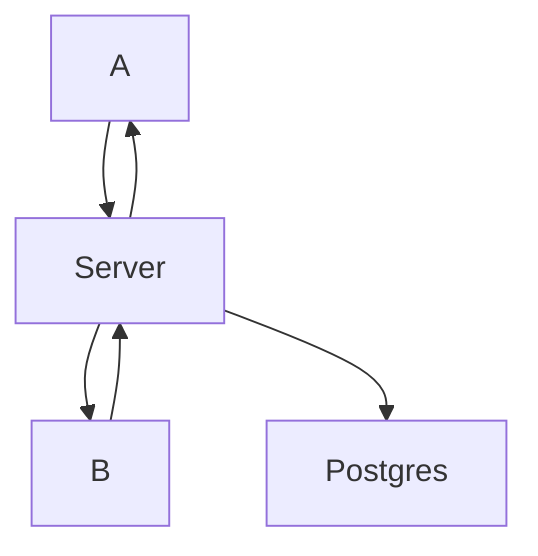

# SharedStorage

## Moving components
- Source Laptop
- Destination Laptop
- Server
- Database

## Server
- /upload : A wants to upload data to B.
    - Look at key associated with source machine.
    - Encrypt data using key
    - Make request to destination and add job in destination's queue.
    - Once ready, destination sends destination details to source.
    - source sends info to destination. Main project
    - async process so upload and download can take place. 

- /download: A wants to download its information from B.
    - Server generates and shares topic to A and B.
    - Server checks if A is subscribing correctly.
    - Server asks B to send A's data at specific location.
    - B publishes message to broker. A receives information.
    - Client checks checksum and sends confirmation.
    - A and B unsubscribe. Server forces unsubscribe.
    - Device decrypts data received at location.

- /register: A wants to join system for first time, or again after switching on.
    - A requests for cookie
    - Server assigns cookie to client and responds with cookie information

To do
- Incorrect destination or incorrect packet received should be notified to the server from the client.
- When acknowledge from client is not sent to server before shutting down machine, all acks should be saved in buffer of machine. When machine reconnects, it should send all acks.